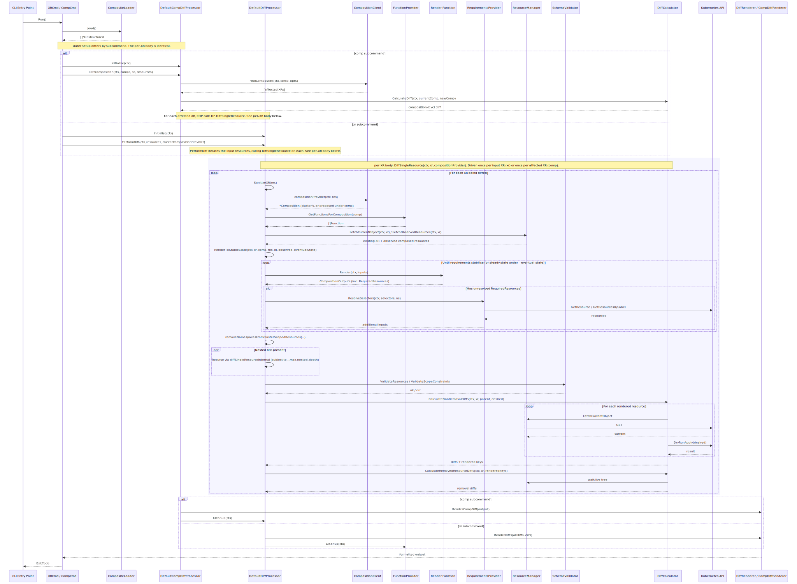

# Crossplane Diff Command - Design Document

## 1. Introduction

### 1.1 Purpose

The `crossplane-diff diff` command is a standalone tool that visualizes the differences between
Crossplane resources in a YAML file and their resulting state when applied to a live Kubernetes cluster. This is similar
to `kubectl diff` but with specific enhancements for Crossplane resources, particularly Composite Resources (XRs) and
their composed resources.

### 1.2 Guiding Principles

The design prioritizes the accuracy of the diff above all; we decline to proceed in the case of errors or ambiguity,
unless that ambiguity is the result of unknowable information (e.g., a dependency in a later pipeline step on the
`status` of an object rendered in an earlier step which will not be populated until the MR is applied by the provider).

To this end, the design reaches into the cluster _extensively_ for any information that is needed to produce a diff,
including functions, compositions, requirements (including environment configs), current state of the XR and any
downstream resources, and XRDs and CRDs for validation.

There is one exception, however, which is that in order to avoid API throttling, we cache resources on first discovery.

### 1.3 Crossplane v2 Support

This tool supports both Crossplane v1 and v2 resource definitions. A key enhancement in Crossplane v2 is the introduction
of namespaced Composite Resource Definitions (XRDs), which allows XRDs to be scoped to either `Cluster` or `Namespaced`.
The diff command automatically handles both scopes:

- **Cluster-scoped XRDs**: Traditional cluster-wide resources that exist at the cluster level
- **Namespaced XRDs**: Resources that are confined to a specific namespace, providing better isolation and multi-tenancy support

The tool reads namespace information directly from the XR definitions in the input YAML files, not from a command-line flag.
It then:
- Validates that namespaced resources have appropriate namespace settings
- Propagates the XR's namespace to managed resources that don't specify one
- Enforces scope constraints (e.g., namespaced XRs cannot own cluster-scoped managed resources, except for claims)

### 1.4 Scope

The Diff command enables users to:

- Preview changes before applying them to a cluster
- Visualize differences at multiple levels: both the XR itself and all downstream composed resources
- Support the full Crossplane composition mechanism, including functions
- Handle resource naming patterns (generateName)
- Detect resources that would be removed

## 2. Background

The Crossplane community has [long desired](https://github.com/crossplane/crossplane/issues/1805) a mechanism to
understand the would-be surface area of proposed changes to Crossplane resources. Platform administrators and
application teams would like the ability to review changes before they are applied, especially in GitOps workflows. This
requirement is particularly critical when working with complex compositions that result in multiple managed resources
being created or updated.

Currently, users lack visibility into how changes to Composite Resources (XRs) or their configurations translate to
changes in the underlying Managed Resources (MRs) and ultimately in the external systems. This makes it challenging to
understand the impact of changes, troubleshoot issues, and confidently apply updates to production environments.

## 3. Goals and Non-Goals

### 3.1 Goals

The `crossplane-diff diff` command aims to:

1. Provide a clear, familiar way to preview changes that would be made to external resources before they are applied
2. Support GitOps workflows by enabling change review within CI/CD pipelines
3. Enhance the debugging experience when working with complex compositions
4. Provide a familiar experience similar to `kubectl diff` or `argocd app diff` for Crossplane resources

### 3.2 Non-Goals

1. Perform a dry-run in the server
2. Build a GUI for visualizing differences
3. Provide historical tracking of changes over time

### 3.3 User Personas

The Diff command is designed with several distinct user personas in mind, each with different needs and permission
levels:

#### 3.3.1 CI/CD Pipeline User

**Primary Persona (Current Focus)**

This persona represents automated CI/CD workflows that run in environments with relatively unrestricted permissions:

- Generates diffs for pull request reviews
- Validates changes before deployment
- Typically runs with service account credentials that have broad read access
- Needs reliable, programmatic output that can be incorporated into reports

The current implementation primarily targets this persona, as it requires expansive permissions to query various cluster
resources needed for accurate diffing.

#### 3.3.2 Composition Developer

This persona represents DevOps engineers and platform administrators who create and maintain compositions:

- Has broad permissions to create and modify XRs and compositions
- Needs visibility into how composition changes affect downstream resources
- Uses the diff tool interactively to debug composition issues
- Requires the ability to compare different versions of compositions (particularly Composition Revisions)
- Wants to validate how changes to compositions will impact existing XRs

The current implementation supports basic modification scenarios for this persona, but the planned support for diffing
against Composition Revisions (see section 9.2) will be particularly valuable. This will enable Composition Developers
to see exactly how downstream resources from an XR would change when moving from an older to a newer Composition
Revision, providing crucial validation before promoting new composition versions to production.

The diff command, or an enhancement to the validate command, may serve this persona better in the future by allowing
validation of provider updates and their corresponding CRD upgrades against XRs and compositions that are already in the
cluster.

#### 3.3.3 End-User Developer

This persona represents application developers who consume composite resources:

- Has limited permissions, focused on specific namespaces or resource types
- Wants to understand the impact of changes to their own XRs
- May not have visibility into all dependencies or composition details
- Needs simplified output focused on resources they care about

The current implementation may not fully support this persona due to permission requirements. Future enhancements (see
section 10) will address this by allowing requirements to be supplied on the command line instead of being queried from
the cluster, or may potentially allow proceeding naively in case of insufficient permissions to read downstream objects.

### 3.4 Required Permissions

For the current implementation, the following logical permissions are required:

1. **Read access to Crossplane definitions**:
    - XRDs (CompositeResourceDefinitions)
    - Compositions
    - Composition Functions

2. **Read access to Crossplane runtime resources**:
    - Composite Resources (XRs)
    - Claims
    - Managed Resources (MRs)

3. **Read access to Crossplane configuration**:
    - EnvironmentConfigs

4. **Read access to Kubernetes resources**:
    - CRDs (CustomResourceDefinitions)
    - Resources referenced in Requirements
    - Resources referenced in templates or functions

5. **Read access to resource hierarchies**:
    - Owner references
    - Resource relationships maintained by Crossplane

These permissions are needed to accurately render resources, resolve requirements, validate against schemas, and
identify resources that would be removed by changes. For the CI/CD and Composition Developer personas, these permission
requirements are generally not problematic. For the End-User Developer persona, these extensive permissions may be
challenging to obtain in many organizational contexts.

## 4. Integration Test Cases

Yes, these come before the design.  The test cases covered lead to the particular implementation, and so we present them 
first as a part of requirements.

To ensure the reliability and correctness of the Diff command, comprehensive integration tests verify the functionality
across a wide range of scenarios that users may encounter in real-world usage. These test cases serve as both validation
criteria and usage examples, demonstrating the expected behavior of the command in various situations. The integration
test cases cover:

### 4.1 Basic Diff Scenarios

- **New Resource Creation**: Tests that new resources show the correct additive diff output with proper color
  formatting.
- **Resource Modification**: Verifies that changes to existing resources are correctly identified and displayed.
- **Modified XR with New Downstream Resource**: Tests that when an XR is modified in a way that generates new downstream
  resources, both the modification to the XR and the creation of the new resource are properly displayed.

### 4.2 Environment Configuration Testing

- **EnvironmentConfig Incorporation**: Tests that environment configurations are correctly incorporated into the diff
  output, showing how environment-specific values affect the rendered resources.

### 4.3 External Resource Dependencies

- **External Resource References**: Verifies that the diff command correctly handles dependencies on resources that are
  referenced but not directly managed by the XR, including:
    - Field values from external ConfigMaps
    - References to external named resources
    - Changes that affect external dependencies

### 4.4 Templating and Functions

- **Go-templating Function**: Tests diffing with templated ExtraResources embedded in go-templating functions, ensuring
  that the diff correctly processes resources generated through templates.

### 4.5 Resource Hierarchy and Removal Detection

- **Resource Removal Detection**: Tests that resources which would be removed by a change are correctly identified and
  shown in the diff output.
- **Hierarchical Resource Relationships**: Verifies that parent-child relationships between resources are correctly
  understood, including cascading removal of child resources when a parent would be removed.

### 4.6 Resource Naming Patterns

- **Resources with generateName**: Tests that resources using Kubernetes generateName pattern are correctly diffed by
  matching based on owner references rather than exact names.
- **New XR with generateName**: Verifies that new XRs using generateName show the appropriate placeholder in the diff
  output.

### 4.7 Multiple Resource Handling

- **Multiple XRs**: Tests processing multiple input files containing different XRs, ensuring that all changes are
  correctly identified and summarized.

### 4.8 Composition Selection

- **Composition Selection by Reference**: Tests selecting specific compositions using a direct reference.
- **Composition Selection by Label Selector**: Verifies that compositions can be selected using label selectors.
- **Ambiguous Composition Selection**: Tests that appropriate errors are returned when composition selection is
  ambiguous.

### 4.9 Claim Handling

- **New Claim Processing**: Tests that new claims are correctly processed, showing both the claim itself and its
  resulting composed resources.
- **Modified Claim Processing**: Verifies that changes to existing claims correctly propagate to their underlying
  resources in the diff output.

### 4.10 Output Formatting and Options

- **Color Output**: Tests that color formatting is correctly applied when enabled.
- **No-color Option**: Verifies that color codes are omitted when the `--no-color` flag is used.
- **Summary Output**: Tests that the summary of changes (added, modified, removed) is correctly generated.
- **Structured Output (JSON / YAML)**: Field-level assertions on `--output json` / `--output yaml` payloads using
  `tu.AssertStructuredDiff` and `tu.AssertStructuredCompDiff` builders. These let tests assert on specific old/new
  values and on summary counts without depending on ANSI escape sequences. Errors must appear in both stderr and the
  structured output.
- **Typed Validation Failures**: Schema-validation tests use the fluent `WithError` / `WithValidationFailure` /
  `WithFieldError` builder chain to pin specific GVKs, namespaces, statuses, error types (`schema`, `cel`,
  `unknownField`, `defaulting`), and field paths. Message wording is intentionally not asserted so apimachinery
  upgrades can shift phrasing without breaking tests.

### 4.11 Composition Diff Scenarios

The `comp` subcommand has its own set of integration tests:

- **Affected XR Enumeration**: Verifies that all XRs using the proposed composition are correctly listed.
- **Composition-level Diff**: Tests that the top-level composition diff is rendered alongside per-XR impact.
- **Filtering**: Covers `--namespace`, `--resource [namespace/]name`, and `--include-manual`. The
  `--namespace`/`--resource` mutual-exclusion error path is exercised. The `--resource` preflight (every named ref must
  match at least one input composition) is exercised.
- **Update Policy Handling**: Verifies that `Manual` XRs are excluded by default and included with `--include-manual`,
  and that both v1 (`spec.compositionUpdatePolicy`) and v2 (`spec.crossplane.compositionUpdatePolicy`) are honoured.
- **Downstream Field Changes**: Asserts field-level old/new values on composed resources of affected XRs.

### 4.12 Nested XRs and Eventual State

- **Nested XR Recursion**: Tests that composed XRs are themselves diffed, with identity preserved across renders by
  fetching observed state.
- **`--max-nested-depth`**: Verifies the recursion limit short-circuits cleanly.
- **Two-phase Diff**: Verifies that resources rendered only by nested XRs are not falsely flagged as removals.
- **`--eventual-state`**: Tests multi-stage compositions (e.g., function-sequencer / `function-conditional`) whose
  full effect requires multiple reconciliation cycles.

### 4.13 Claim Edge Cases

- **New Claim with `spec.claimRef`**: Verifies that compositions referencing
  `.observed.composite.resource.spec.claimRef.*` render correctly for new claims (no backing XR yet exists), via the
  synthesised dummy XR.
- **`crossplane.io/composite` Label**: Confirms that diffing a Claim does not show spurious changes to the composite
  label, since Crossplane uses the XR name there even when rendering from a Claim.

These comprehensive test cases ensure that both subcommands function correctly across the full range of Crossplane
resource types and composition patterns. The implementation described in the following sections is designed to satisfy
all these test cases.

## 5. Architecture Overview

### 5.1 High-Level Overview

The `crossplane-diff` binary exposes two diff subcommands and a `version` subcommand:

- **`crossplane-diff xr [FILE]…`** (alias: `diff`) — given one or more XR or claim YAMLs, show the changes that would
  result from applying them to the cluster.
- **`crossplane-diff comp [FILE]…`** — given one or more updated Composition YAMLs, find every XR in the cluster that
  uses each composition and show the impact of the composition change on each, including a top-level diff of the
  composition itself.

Both subcommands process resources from files or stdin, compare them against the current state in the cluster, and
display differences in a familiar format. They share the same underlying per-XR rendering and diffing machinery — `comp`
delegates to the same `DiffProcessor` that `xr` uses, supplying the proposed composition through a `CompositionProvider`
callback.

The implementation leverages existing Crossplane and Kubernetes machinery to:

1. Find the appropriate composition for a composite resource (or use the user-supplied one for `comp`)
2. Extract dependency information from composition functions
3. Perform a simulated reconciliation through the render pipeline
4. Use server-side dry-run to determine resource-level changes without applying them
5. Walk the live resource tree to detect resources that would be removed

The XR-diff flow is:

1. Load resources from files/stdin
2. For each XR or claim:
    1. Resolve the matching composition
    2. Render the XR through the composition pipeline
    3. While the render reports new `RequiredResources` selectors, resolve them and re-render
    4. Recurse into any nested XRs (subject to `--max-nested-depth`), preserving their identity by fetching their
       observed state from the cluster
    5. Validate the rendered tree against CRD/XRD schemas and enforce scope constraints
    6. Compare against current state in the cluster (server-side dry-run + tree walk)
3. Format and display differences in the configured output format

The composition-diff flow layers on top of this: discover affected XRs in the cluster, optionally filter by namespace
or resource refs, drop XRs with `Manual` update policy unless `--include-manual` is set, run the per-XR flow above for
each, and aggregate into a `CompDiffOutput`.

### 5.2 Architectural Layers

The Crossplane Diff command follows a layered architecture pattern with clear separation of concerns. Each layer has
specific responsibilities and depends only on lower layers.


*Figure 1: Conceptual layers of the Crossplane Diff command architecture and their responsibilities*

#### 5.2.1 Command Layer

The top-level layer that handles command-line arguments, flags, and coordinates the execution flow.

**Key Components:**

- `Cmd`: Main command structure that processes arguments and flags
- Help functions: Provides usage instructions to users

**Responsibilities:**

- Command parsing
- Argument validation
- Help text generation
- Entry point coordination

#### 5.2.2 Application Layer

The orchestration layer that initializes the application context and coordinates the overall diff process.

**Key Components:**

- `AppContext`: Holds application-wide dependencies and clients
- `DiffProcessor`: Orchestrates per-XR diffing (used directly by `xr`, held as a named `xrProc` field on `DefaultCompDiffProcessor`)
- `CompDiffProcessor`: Orchestrates composition-impact diffing for `comp`
- `Loader`: Handles loading resources from files or stdin

**Responsibilities:**

- Context management
- Client initialization
- Process coordination
- Resource loading
- Result aggregation
- Cleanup of ephemeral state (Docker function containers, networks)

#### 5.2.3 Domain Layer

The business logic layer containing the core diff functionality, resource management, and rendering.

**Key Components:**

- `DiffCalculator`: Computes differences between resources (split into non-removal and removal phases for nested XRs)
- `SchemaValidator`: Validates resources against their schemas and enforces scope constraints
- `ResourceManager`: Fetches cluster state and manages owner references
- `RequirementsProvider`: Resolves environment-config and label-selector requirements between render iterations
- `FunctionProvider`: Resolves the function set for a composition, with strategies for caching and registry override
- `DiffRenderer` / `CompDiffRenderer`: Format and display XR and composition diffs (human-readable or structured
  JSON/YAML)
- `Render Function`: Handles composition-pipeline rendering; normally a reference to the upstream `render` package

**Responsibilities:**

- Diff calculation
- Resource rendering
- Resource management
- Schema validation
- Requirement processing
- Diff visualization

#### 5.2.4 Client Layer

The infrastructure access layer that interfaces with Kubernetes and Crossplane.

**Key Components:**

- Kubernetes Clients: `ApplyClient`, `ResourceClient`, `SchemaClient`, `TypeConverter`
- Crossplane Clients (injected via `AppContext`): `CompositionClient`, `CredentialClient`, `DefinitionClient`,
  `EnvironmentClient`, `FunctionClient`, `ResourceTreeClient`. `CompositionRevisionClient` is not part of the injected
  bundle — `DefaultCompositionClient` constructs and owns one internally.

**Responsibilities:**

- Kubernetes API interaction
- Crossplane resource access
- Resource conversion
- Type handling
- Server-side apply

#### 5.2.5 External Systems

The actual Kubernetes API server and cluster resources that the command interacts with.

**Responsibilities:**

- Kubernetes API server
- Resources in cluster
- CRDs and schemas


*Figure 2: Clean layered architecture showing the main components in each layer*

### 5.3 Data Flow

The data flow through the system follows these key steps:


*Figure 3: Data flow through the Crossplane Diff command system*

1. **Input Processing**:
    - YAML files or stdin content is loaded and parsed into unstructured resources

2. **Processing**:
    - For each Composite Resource (XR):
        - Find the matching composition
        - Render the XR and composed resources using Crossplane functions
        - Discover and resolve requirements for rendering
        - Validate the rendered resources against schemas
        - Calculate diffs between current and desired states

3. **Output**:
    - Format and display diffs to the console

## 6. Component Design


*Figure 4: DiffProcessor architecture showing its subcomponents and their relationships*

### 6.1 DiffProcessor

The `DiffProcessor` is the central component for XR diff. It uses a dependency injection pattern with factories for its
subcomponents. `DefaultCompDiffProcessor` (see §6.2) holds one as a named `xrProc` field and delegates per-XR rendering to it.

#### 6.1.1 Interfaces and Implementation

```go
// DiffProcessor interface for processing resources.
type DiffProcessor interface {
    // PerformDiff processes all resources and writes diff output to the configured writer.
    // Returns (hasDiffs, error); a nil error with hasDiffs=false means everything matched the cluster.
    PerformDiff(ctx context.Context, resources []*un.Unstructured, compositionProvider types.CompositionProvider) (bool, error)

    // DiffSingleResource processes one resource and returns its diffs without rendering them.
    // Used by CompDiffProcessor to drive per-XR diffs.
    DiffSingleResource(ctx context.Context, res *un.Unstructured, compositionProvider types.CompositionProvider) (map[string]*dt.ResourceDiff, error)

    // Initialize loads required resources like CRDs.
    Initialize(ctx context.Context) error

    // Cleanup releases resources held by the processor (in particular, Docker function containers
    // started during rendering — without this they leak for the lifetime of the process).
    Cleanup(ctx context.Context) error
}
```

A `CompositionProvider` is `func(ctx, *Unstructured) (*apiextensionsv1.Composition, error)`. The `xr` subcommand passes a
provider that looks up matching compositions in the cluster; the `comp` subcommand passes one backed by the updated
composition file under test, so the same per-XR diff machinery serves both flows.

The `DefaultDiffProcessor` uses several subcomponents:

- `fnProvider`: Resolves the function set for a given composition (see §6.6)
- `compClient`, `defClient`, `schemaClient`, `treeClient`, `applyClient`: Cluster I/O (see §6.8)
- `schemaValidator`: Validates resources against schemas and enforces scope constraints
- `diffCalculator`: Calculates differences between resources
- `diffRenderer`: Formats and displays XR diffs
- `requirementsProvider`: Handles requirements (env-configs, label selectors) for rendering

#### 6.1.2 Configuration

The `ProcessorConfig` structure provides configuration options:

- `Colorize`, `Compact`: Visual formatting toggles for the human-readable renderer.
- `OutputFormat`: One of `diff`, `json`, `yaml`. Selects between the human-readable and structured renderers.
- `MaxNestedDepth`: Recursion limit for nested-XR diff (`--max-nested-depth`).
- `MaxRenderIterations`: Cap on the requirements-discovery loop (`--max-iterations`).
- `IncludeManual`: For `comp`, also consider XRs whose composition update policy is `Manual`.
- `EventualState`: Synthesize composed-resource readiness between render iterations to model the steady state of
  multi-stage compositions (`--eventual-state`).
- `IgnorePaths`: Field paths to suppress from diffs (e.g., status fields known to be reconciler-set).
- `FunctionCredentials`: Image-pull credentials for private function registries.
- `FunctionRegistryOverride`: Rewrites function image references to a mirror.
- `CrossplaneRenderBinary`: Optional path to an external `crossplane render` binary (otherwise the in-process render
  package is used).
- `Stdout`, `Stderr`: Output sinks (writers are no longer threaded through method calls).
- `Logger`: Structured logger, propagated to all subcomponents.
- `RenderFunc`: Renders a composition pipeline; defaults to the in-process engine.
- `Factories`: Factory functions for creating subcomponents (used for testing and to swap caching strategies).

Note: `comp`'s `--namespace` filter and `--resource` filter are call-time parameters to `DiffComposition`, not
processor-wide config; they describe what to include in a single impact analysis run, not how the processor itself
behaves. `xr` doesn't need a namespace at all — the XR YAML carries its own.

### 6.2 CompDiffProcessor

The `CompDiffProcessor` powers the `comp` subcommand. Where `DiffProcessor` answers "what changes if I apply this XR?",
`CompDiffProcessor` answers "what changes for every XR currently using this composition if I update it?"

#### 6.2.1 Interface and Implementation

```go
// CompDiffProcessor defines the interface for composition diffing.
type CompDiffProcessor interface {
    // DiffComposition processes composition changes and shows impact on existing XRs.
    // When `resources` is non-empty, impact analysis is restricted to the named composites.
    DiffComposition(ctx context.Context, compositions []*un.Unstructured, namespace string, resources []k8stypes.NamespacedName) (bool, error)

    Initialize(ctx context.Context) error
    Cleanup(ctx context.Context) error
}
```

`DefaultCompDiffProcessor` holds a `DiffProcessor` (as a named `xrProc` field) and a `CompositionClient`, and orchestrates:

1. **Discover affected XRs.** For each input composition: list cluster XRs whose `compositionRef`/`compositionSelector`
   resolves to it. Optional filters: `--namespace` (scope to one namespace), `--resource` (limit to specific composite
   names, mutually exclusive with `--namespace`).
2. **Partition by update policy.** XRs with `compositionUpdatePolicy: Manual` are dropped unless `--include-manual` is
   set, since they would not be affected by a composition change anyway.
3. **Diff the composition itself.** Compute a top-level diff between the proposed composition and the cluster's current
   version, surfaced as `CompositionDiff`.
4. **Diff each XR.** Delegate to the `xrProc` `DiffProcessor` via `DiffSingleResource`, supplying a
   `CompositionProvider` that returns the proposed composition for the affected XR's GVK and the cluster's composition
   otherwise (so nested XRs that use a different composition are diffed against their unchanged composition).
5. **Aggregate.** Produce a `CompDiffOutput` with composition-level changes, an `XRImpact` entry per XR, and an
   `AffectedResourcesSummary` (changed / unchanged / errored counts).

The processor deliberately does not default its own `RenderFunc` (it routes rendering through `xrProc`),
because `NewEngineRenderFn` allocates a Docker bridge network whose teardown lives on the XR processor's `Cleanup`.

### 6.3 DiffCalculator

The `DiffCalculator` is responsible for calculating differences between resources.

#### 6.3.1 Interface and Implementation

```go
// DiffCalculator calculates differences between resources.
type DiffCalculator interface {
    // CalculateDiff computes the diff for a single resource (used for the XR itself and for the composition diff).
    CalculateDiff(ctx context.Context, composite *un.Unstructured, desired *un.Unstructured) (*dt.ResourceDiff, error)

    // CalculateDiffs is the convenience entry point: computes non-removal diffs and removal diffs in sequence
    // for a single (non-nested) render.
    CalculateDiffs(ctx context.Context, xr *cmp.Unstructured, desired render.CompositionOutputs) (map[string]*dt.ResourceDiff, error)

    // CalculateNonRemovalDiffs computes diffs for everything in the rendered set, returning the diffs and
    // a set of rendered resource keys. Splitting this from removal detection lets nested XRs be processed
    // before any "missing from render" decisions are made (a nested XR may render additional resources
    // that the parent's render does not see).
    CalculateNonRemovalDiffs(ctx context.Context, xr *cmp.Unstructured, parentComposite *un.Unstructured, desired render.CompositionOutputs) (map[string]*dt.ResourceDiff, map[string]bool, error)

    // CalculateRemovedResourceDiffs identifies resources that exist in the cluster under this XR but are
    // absent from the merged set of rendered resource keys, and produces removal diffs for them.
    CalculateRemovedResourceDiffs(ctx context.Context, xr *un.Unstructured, renderedResources map[string]bool) (map[string]*dt.ResourceDiff, error)
}
```

The two-phase split (`CalculateNonRemovalDiffs` + `CalculateRemovedResourceDiffs`) is load-bearing: when an XR contains
nested XRs, the parent must finish processing its children before the framework can decide what counts as "removed".
Otherwise nested-only resources would be falsely flagged as removals because they don't appear in the parent's render
output.

The `DefaultDiffCalculator` handles:

- Retrieving current resources from the cluster (via `ResourceManager`)
- Performing dry-run applies to determine the would-be state
- Generating text-based diffs between current and desired
- Identifying resources that would be removed

### 6.4 ResourceManager

The `ResourceManager` handles resource-related operations such as fetching current resources, walking the live resource
tree, and managing ownership references.


*Figure 5: Resource loading and validation architecture showing how resources are loaded and validated*

#### 6.4.1 Interface and Implementation

```go
// ResourceManager handles resource-related operations like fetching, updating owner refs,
// and identifying resources to be removed.
type ResourceManager interface {
    // FetchCurrentObject retrieves the current state of an object from the cluster.
    // Used for both name-based and generateName/label-based lookup.
    FetchCurrentObject(ctx context.Context, composite *un.Unstructured, desired *un.Unstructured) (*un.Unstructured, bool, error)

    // UpdateOwnerRefs ensures all OwnerReferences have valid UIDs (synthesizing dry-run UIDs
    // for resources that don't yet exist).
    UpdateOwnerRefs(ctx context.Context, parent *un.Unstructured, child *un.Unstructured)

    // FetchObservedResources walks the live resource tree under an XR and returns the composed
    // resources observed in the cluster. Used to preserve the identity of nested XRs across
    // re-renders (so re-rendering doesn't appear to "create" a child XR that already exists).
    FetchObservedResources(ctx context.Context, xr *cmp.Unstructured) ([]cpd.Unstructured, error)
}
```

The `DefaultResourceManager` handles:

- Looking up resources by name
- Looking up resources by labels and annotations (`crossplane.io/composition-resource-name`, claim-name labels) for
  resources rendered with `generateName`
- Walking the resource tree (via `ResourceTreeClient`) to enumerate observed children of an XR
- Managing owner references and synthesizing UIDs for dry-run

### 6.5 SchemaValidator

The `SchemaValidator` validates resources against their schemas and enforces Crossplane v2 scope rules before diffs are
calculated.

#### 6.5.1 Interface and Implementation

```go
// SchemaValidator handles validation of resources against CRD schemas.
type SchemaValidator interface {
    // ValidateResources validates resources using schema validation.
    ValidateResources(ctx context.Context, xr *un.Unstructured, composed []cpd.Unstructured) error

    // EnsureComposedResourceCRDs ensures we have all required CRDs for validation, fetching them
    // lazily from the cluster the first time a GVK is encountered.
    EnsureComposedResourceCRDs(ctx context.Context, resources []*un.Unstructured) error

    // ValidateScopeConstraints enforces Crossplane v2 scope rules: namespaced XRs cannot own
    // cluster-scoped composed resources (claims are the only allowed cluster→namespace exception),
    // and namespaced composed resources must live in the XR's namespace.
    ValidateScopeConstraints(ctx context.Context, resource *un.Unstructured, expectedNamespace string, isClaimRoot bool) error
}
```

The `DefaultSchemaValidator` handles:

- Loading CRDs from the cluster on demand
- Converting XRDs to CRDs (so XRs can be schema-validated)
- Validating resources against those schemas via the upstream `pkg/validate.SchemaValidate` structured API
- Enforcing scope constraints across the rendered tree

`SchemaValidate` returns a `*pkgvalidate.ValidationResult` with typed per-resource records — `ResourceValidationResult`
entries containing `FieldValidationError` records with type tags (`schema`, `cel`, `unknownField`, `defaulting`), field
paths, messages, and offending values. The validator surfaces this structure to callers in two ways:

- A `SchemaValidationError` carries the `*ValidationResult` so error-handling code can inspect typed failures
  programmatically.
- The structured-output renderers expose it on the wire as `OutputError.ValidationFailures` (see §6.8.3), so JSON/YAML
  consumers don't need to parse the human-readable `Message` string.

Note that `SchemaValidate` deep-copies its inputs and does not mutate them. The previous, line-parsing API
(`validate.SchemaValidation`) fused defaulting with validation as a side-effect; with the new API, defaulting is
explicit. The processor calls `clixr.ApplyCRDDefaults` (renamed from the old `render.DefaultValues`) on the rendered
tree before invoking `ValidateResources`, preserving the invariant that the diff calculator sees fully-defaulted
resources.

### 6.6 RequirementsProvider

The `RequirementsProvider` provides extra resources that composition functions ask for via `RequiredResources`. It is a
concrete struct (not an interface) and is owned by the XR processor.

#### 6.6.1 Implementation

The `RequirementsProvider` handles:

- Caching frequently used resources to avoid re-fetching across the iterative render loop
- Fetching resources by name or label selector, scoped to the XR's namespace where appropriate
- Loading EnvironmentConfigs as a baseline available to every render

**Unmet requirements are non-fatal.** A `matchName` selector that resolves to a NotFound (the referenced resource
doesn't exist) returns `(nil, nil)` from `processNameSelector`, matching how `matchLabels` already handles a zero-match
result and how upstream Crossplane treats unmet requirements in
`internal/xfn/required_resources.go`. The function pipeline sees an empty entry for that requirement key — exactly as
it would during real reconcile — and any user-facing diagnostic comes from the function's own conditions/results,
which the diff tool captures in the final render output. A debug log records the unmet requirement so a user running
with `-v=1` (or higher) can trace why a composition behaved as if a required resource was missing. All other fetch
errors (RBAC denial, API server unreachable, etc.) still wrap and propagate, aborting the diff.

(Claim-to-XR synthesis for new claims is not a `RequirementsProvider` responsibility — it happens in
`DefaultDiffProcessor.resolveBackingXRForClaim` and delegates to upstream's `ConvertClaimToXR`. See §7.1.)

### 6.7 FunctionProvider

The `FunctionProvider` is the seam between the diff tool and Crossplane composition functions. Function containers can
be expensive to spin up, so this layer governs how — and how aggressively — they are reused across renders.

#### 6.7.1 Interface and Implementations

```go
// FunctionProvider resolves the function set used by a given composition.
type FunctionProvider interface {
    GetFunctionsForComposition(comp *apiextensionsv1.Composition) ([]pkgv1.Function, error)
    Cleanup(ctx context.Context) error
}
```

Three implementations are wired up at the CLI layer based on configuration:

- **`DefaultFunctionProvider`**: Fetches the function definitions from the cluster on demand. Used when the same
  composition is unlikely to be rendered repeatedly.
- **`CachedFunctionProvider`**: Lazy-loads functions per composition and caches them by composition name. Composition
  diff renders the same composition many times (once per affected XR), so cached function containers are reused across
  XRs in the same run. The factory selection happens at the CLI layer; the processors are oblivious to which strategy
  is in use.
- **`RegistryOverrideFunctionProvider`**: Wraps another provider and rewrites function image references to a mirror
  (used with `--function-registry-override`).

`Cleanup` is responsible for terminating any function containers the provider has started; it is invoked by the
processor's `Cleanup`.

All three providers also apply the `render.crossplane.io/runtime-docker-network` annotation to every returned function
package when the `CROSSPLANE_DIFF_DOCKER_NETWORK` environment variable is set. This is the user-facing knob for running
`crossplane-diff` inside a Docker container (e.g. a GitHub Actions container job): the spawned function containers join
the caller's network instead of the default Docker bridge, where they would be unreachable from the caller. The
annotation is applied on every `GetFunctionsForComposition` call, including cache hits in `CachedFunctionProvider`, so
the env var works correctly regardless of when it is set relative to cache population. Any non-empty value the user
has pre-set on a function package is preserved.

### 6.8 DiffRenderer and CompDiffRenderer

The renderer layer formats diff results. It is split into two interfaces — one per subcommand — and each has a
human-readable and a structured (JSON/YAML) implementation.


*Figure 6: Diff rendering architecture showing how diffs are formatted and displayed*

#### 6.8.1 Interfaces

```go
// DiffRenderer handles rendering XR diffs.
type DiffRenderer interface {
    // RenderDiffs writes per-resource diffs and any per-resource errors. The output writer is held
    // by the renderer (configured at construction time), not passed in per call, so the same
    // interface can serve human-readable and structured renderers without leaking io.Writer.
    RenderDiffs(diffs map[string]*dt.ResourceDiff, errs []dt.OutputError) error
}

// CompDiffRenderer handles rendering composition diffs.
type CompDiffRenderer interface {
    RenderCompDiff(output *CompDiffOutput) error
}
```

Implementations:

- `DefaultDiffRenderer` / `DefaultCompDiffRenderer`: Human-readable colored output (or plain text under `--no-color`),
  with optional `--compact` mode for large diffs.
- `StructuredDiffRenderer` / `StructuredCompDiffRenderer`: Emit JSON or YAML controlled by `--output {json,yaml}`. The
  YAML encoder uses `sigs.k8s.io/yaml`, so JSON struct tags are reused for YAML field names.

#### 6.8.2 Output format selection and error contract

The selection is via `OutputFormat` on `ProcessorConfig`:

```go
type OutputFormat string
const (
    OutputFormatDiff OutputFormat = "diff"  // default; human-readable
    OutputFormatJSON OutputFormat = "json"
    OutputFormatYAML OutputFormat = "yaml"
)
```

Under `json`/`yaml`, errors are written to **both** stderr (for human visibility) and the structured output (so CI/CD
pipelines can parse them programmatically). The structured renderers always emit a valid document — even when every XR
fails — by attaching errors to an `OutputError` field. `OutputError` uses JSON struct tags only (the YAML library reads
JSON tags), so the field naming is consistent across formats.

#### 6.8.3 Structured output types

The structured types are split across two files:

- The top-level output types and their components live in `cmd/diff/renderer/structured_renderer.go` alongside the
  structured renderers themselves: `StructuredDiffOutput`, `Summary`, `ChangeDetail`, `CompDiffOutput`,
  `CompositionDiff`, `XRImpact`, `XRStatus`, `AffectedResourcesSummary`, `DownstreamChanges`.
- The error envelope and the validation-failure types live in `cmd/diff/renderer/types/`: `OutputError`,
  `ResourceValidationFailure`, `FieldValidationError`. These are separated because they're consumed by the
  human-readable renderer too, not just the structured ones.

All of these are part of the public output contract:

- `StructuredDiffOutput` — XR diff JSON/YAML root: `Summary` (added/modified/removed counts), `Changes []ChangeDetail`
  (one entry per non-equal resource, carrying type/apiVersion/kind/name/namespace and the old/new field map), optional
  `Errors []OutputError`.
- `CompDiffOutput` — composition diff JSON/YAML root: `Compositions []CompositionDiff` (one entry per input
  composition) plus optional top-level `Errors []OutputError` for failures that couldn't be attributed to a single
  composition.
- `CompositionDiff` — per-composition entry: `Name`, optional `Error`, optional `CompositionDiff *ResourceDiff` (the
  composition's own diff against its in-cluster version), `AffectedResources AffectedResourcesSummary`, and
  `ImpactAnalysis []XRImpact`.
- `AffectedResourcesSummary` — counts across the impact analysis: `Total`, `WithChanges`, `Unchanged`, `WithErrors`,
  and optional `FilteredByPolicy` (XRs that matched a `--resource` selector but were dropped by the update-policy
  filter).
- `XRImpact` — per-XR entry inside `ImpactAnalysis`: embeds `corev1.ObjectReference` (apiVersion/kind/name/namespace),
  carries a `Status`, an optional `Error`, and an optional `Diffs map[string]*ResourceDiff` of downstream changes.
- `XRStatus` — enumeration: `"changed"`, `"unchanged"`, `"error"`, `"filtered_by_policy"`.
- `DownstreamChanges` — the JSON-shape wrapper for an XR's downstream diffs, used inside `xrImpactJSON`: a `Summary`
  plus a `[]ChangeDetail`.
- `OutputError` — error envelope used by both XR and comp diff outputs. Carries:
    - `ResourceID`: which user-supplied input the diff was processing (one entry per batched run)
    - `Message`: human-readable error string
    - `ValidationFailures`: optional `[]ResourceValidationFailure`, populated when the error originated from schema
      validation. Lets machine consumers inspect typed failures without parsing `Message`.
- `ResourceValidationFailure` — per-resource view inside `ValidationFailures`. Mirrors upstream
  `pkg/validate.ResourceValidationResult` (apiVersion / kind / name / namespace / status), but is owned by
  `crossplane-diff` so the public JSON schema can evolve independently of upstream's. `Status` surfaces `"invalid"` and
  `"missingSchema"`; valid entries are filtered out so consumers iterating `ValidationFailures` see only failure rows.
- `FieldValidationError` — single field-level error inside `ResourceValidationFailure.Errors`. Carries `Type`
  (`"schema"` / `"cel"` / `"unknownField"` / `"defaulting"`), `Field` (JSONPath, when locatable), `Message`, and
  `Value` (typed: string, number, bool, or struct).

`ResourceID` and `ValidationFailures` are intentionally complementary: `ResourceID` anchors the failure to a specific
batched input, while `ValidationFailures` enumerates every resource (the input itself plus any composed resources)
that failed validation under that input. They overlap on Kind+Name when the input itself is among the failing
resources — that's deliberate, so consumers iterating `ValidationFailures` never miss an XR-level rejection.
`ValidationFailures` is `nil` for non-validation paths (scope check, tool errors, IO errors).

### 6.9 Kubernetes and Crossplane Clients

The client layer provides interfaces to interact with Kubernetes and Crossplane resources.


*Figure 7: Kubernetes and Crossplane client architecture showing the interfaces and implementations*

#### 6.9.1 Kubernetes Clients

- `ApplyClient`: Handles server-side dry-run apply
- `ResourceClient`: Handles basic CRUD operations against the dynamic client
- `SchemaClient`: Handles schema-related operations (fetching CRDs, scope detection)
- `TypeConverter`: Handles GVK ↔ GVR resolution and resource-name lookup

#### 6.9.2 Crossplane Clients

- `CompositionClient`: Finds and fetches Compositions. `DefaultCompositionClient` also constructs and owns a
  `CompositionRevisionClient` internally (it is not part of the injected `xp.Clients` bundle); callers don't wire a
  revision client directly.
- `CompositionRevisionClient`: Fetches CompositionRevisions (groundwork for revision-aware diffing — see §10).
  Accessed via `DefaultCompositionClient`, not directly from `AppContext`.
- `DefinitionClient`: Fetches XRDs and resolves XR/claim relationships
- `EnvironmentClient`: Fetches EnvironmentConfigs
- `FunctionClient`: Fetches Function package definitions and per-composition pipelines
- `CredentialClient`: Resolves function image-pull credentials referenced by `--function-credentials`
  (`FetchCompositionCredentials(ctx, comp) []corev1.Secret` — no error return; credential-fetch failures are logged
  and treated as "no credentials available" for that composition).
- `ResourceTreeClient`: Walks parent/child resource relationships in the cluster

## 7. Key Workflows


*Figure 8: Call sequence diagram showing the interaction between components during a diff operation*

### 7.1 XR Diff Workflow

1. `Cmd` parses arguments and initializes the application context.
2. The `Loader` loads resources from files or stdin.
3. `DiffProcessor.Initialize` loads required schemas.
4. For each input XR or claim:
    - The `DiffProcessor` resolves the matching composition (or, for `comp`, the proposed one supplied via the
      `CompositionProvider`).
    - For claim inputs, `resolveBackingXRForClaim` fetches the backing XR from the cluster if it exists; if the claim
      is brand new, `synthesizeDummyBackingXRForNewClaim` produces a synthetic backing XR via upstream's
      `ConvertClaimToXR` helper. The synthesized XR uses the XRD's authoritative `spec.names.kind`, pins the XR name to
      the claim's name (cleaner diff output than the upstream default suffix), and carries a synthesized `spec.claimRef`
      plus the claim's annotations and `crossplane.io/claim-name` / `crossplane.io/claim-namespace` labels. Rendering
      then proceeds from the (real or synthesized) backing XR with merged Claim spec, producing composed resources with
      correct `crossplane.io/composite` labels.
    - It calls `RenderToStableState` (see §9.5.6.2), which iteratively renders the composition pipeline, resolves any
      `RequiredResources` selectors via the `RequirementsProvider`, and re-renders until the requirement set stabilises
      (or the eventual-state criterion is met under `--eventual-state`).
    - For any nested XRs in the rendered output, the `ResourceManager` fetches their observed state from the cluster to
      preserve identity, then the processor recurses (subject to `--max-nested-depth`).
    - The processor strips namespaces from cluster-scoped composed resources (workaround for upstream
      `SetComposedResourceMetadata` blindly setting namespaces; see §9.5.6.3).
    - The `SchemaValidator` validates the rendered resources and enforces scope constraints
      (`ValidateScopeConstraints`).
    - `DiffCalculator.CalculateNonRemovalDiffs` computes per-resource diffs for the entire (possibly nested) tree.
    - Once the whole tree has been processed, `DiffCalculator.CalculateRemovedResourceDiffs` identifies resources that
      exist in the cluster under this XR but no longer appear in the rendered set.
    - The `DiffRenderer` (human-readable or structured) formats and displays the result.
5. `Cleanup` tears down any function containers / networks created during rendering. This is essential — without it,
   Docker resources leak for the lifetime of the process.

### 7.2 Composition Diff Workflow

1. The `Loader` loads the proposed composition(s).
2. `CompDiffProcessor.Initialize` loads schemas and prepares the delegated XR processor (`xrProc`).
3. For each input composition:
    - List XRs in the cluster that resolve to this composition (`compositionRef` or `compositionSelector`). Optional
      filters: `--namespace`, `--resource [namespace/]name` (mutually exclusive). When `--resource` is supplied, a
      preflight pass ensures every named ref is relevant to at least one input composition; otherwise the call fails
      before any rendering happens.
    - Drop XRs with `compositionUpdatePolicy: Manual` unless `--include-manual` is set.
    - Calculate the composition's own diff against the cluster's current version.
    - For each remaining XR, run the XR diff workflow above, using a `CompositionProvider` that returns the proposed
      composition for the affected XR's GVK and the cluster's composition for any nested XRs of a different kind.
4. Aggregate per-XR results into a `CompDiffOutput` (composition diff + `XRImpact` list +
   `AffectedResourcesSummary`) and render via the `CompDiffRenderer`.

### 7.3 Resource Rendering Workflow

1. The `DiffProcessor` calls the render function with the XR, composition, function set, and any requirements gathered
   so far.
2. The render function executes the composition pipeline:
    - It sets up the initial state with the XR
    - It executes each function in the pipeline
    - It returns the desired state with the XR, composed resources, and `RequiredResources` / `RequiredSchemas`
      selectors describing what additional inputs the functions need on the next pass
3. The `DiffProcessor` resolves any new requirements via the `RequirementsProvider` and reruns the render function if
   the requirement set grew. Under `--eventual-state` it additionally synthesizes Ready conditions on rendered composed
   resources between iterations to model multi-stage compositions.
4. The rendered resources are validated and used for diff calculation.

## 8. Implementation Details

### 8.1 Basic Usage

The binary exposes two diff subcommands:

```
crossplane-diff xr   [FILE]...   # alias: crossplane-diff diff [FILE]...
crossplane-diff comp [FILE]...
```

Similar to `kubectl diff`, both:
1. Accept input from files or stdin (when `-` is specified)
2. Process multiple files when provided — `xr` diffs each input XR/Claim against the cluster; `comp` runs impact
   analysis for each input Composition independently and aggregates the per-composition results into a single output
3. Display a diff of the changes that would be made if the resources were applied

`xr` examples:
```
# Show changes that would result from applying an XR from a file
crossplane-diff xr xr.yaml

# Show changes from stdin
cat xr.yaml | crossplane-diff xr -

# Process multiple files
crossplane-diff xr xr1.yaml xr2.yaml xr3.yaml

# Show changes in a compact format with minimal context
crossplane-diff xr --compact xr.yaml

# Emit machine-readable output for CI/CD
crossplane-diff xr --output json xr.yaml
crossplane-diff xr --output yaml xr.yaml

# Limit nested-XR recursion
crossplane-diff xr --max-nested-depth 3 xr.yaml

# Show steady-state diff for compositions that need multiple reconciliation cycles
crossplane-diff xr --eventual-state xr.yaml
```

`comp` examples:
```
# Show impact of a composition change on every XR using it
crossplane-diff comp updated-composition.yaml

# Run impact analysis for multiple updated compositions in one invocation
crossplane-diff comp comp1.yaml comp2.yaml comp3.yaml

# Restrict impact analysis to one namespace
crossplane-diff comp updated-composition.yaml -n production

# Restrict to specific composites by [namespace/]name (mutually exclusive with -n)
crossplane-diff comp updated-composition.yaml --resource production/my-xr --resource other-xr

# Also include XRs whose update policy is Manual
crossplane-diff comp updated-composition.yaml --include-manual
```

Note that the `xr` subcommand has no `--namespace` flag: namespaced XRs carry their own namespace in YAML, and that
namespace flows through render, validation, dry-run apply, and requirement resolution. The `comp` subcommand's
`--namespace` flag scopes which existing XRs are considered, not which namespace XRs render in.

### 8.2 Output Format

The output will follow familiar diff format conventions. There will be a standard mode and a compact mode:

```
+++ Resource/new-resource-(generated)
+ apiVersion: nop.crossplane.io/v1alpha1
+ kind: NopResource
+ metadata:
+   annotations:
+     cool-field: I'm new!
+     crossplane.io/composition-resource-name: nop-resource
+     setting: value1
+   generateName: new-resource-
+   labels:
+     crossplane.io/composite: new-resource
+ spec:
+   forProvider:
+     conditionAfter:
+     - conditionStatus: "True"
+       conditionType: Ready
+       time: 0s

---
--- XNopResource/removed-resource-downstream
- apiVersion: diff.example.org/v1alpha1
- kind: XNopResource
- metadata:
-   name: removed-resource-downstream
- spec:
-   coolField: goodbye!
-   parameters:
-     config:
-       setting1: value1
-       setting2: value2

---

~~~ Resource/to-be-modified
  apiVersion: diff.example.org/v1alpha1
  kind: XNopResource
  metadata:
    name: to-be-modified
- spec:
-   oldValue: something
+ spec:
+   newValue: something-else
---

Summary: 1 added, 1 modified, 1 removed
```

The diff output will be colorized by default (can be disabled with `--no-color`), and supports a compact mode with the
`--compact` flag that shows minimal context around changes.

```
###### modifications, compact with 2 lines of context:

~~~ Resource/to-be-modified
  metadata:
    name: to-be-modified
- spec:
-   oldValue: something
+ spec:
+   newValue: something-else
---

```

## 9. Design Considerations

### 9.1 Dependency Injection and Inversion of Control

The design uses dependency injection extensively, making the code more testable and modular. Factory functions are used
to create components, allowing for easy customization and testing.

The Diff command leverages the Kong CLI framework's binding mechanisms to implement a sophisticated dependency injection
system. In the `Cmd.AfterApply` method, various components are initialized and then bound to the Kong context:

```go
   ctx.Bind(appCtx) // appCtx is a container that holds refs to all the clients we use for initializing dependencies
   ctx.BindTo(proc, (*dp.DiffProcessor)(nil))
   ctx.BindTo(loader, (*internal.Loader)(nil))
```

This approach allows the command to:

1. Inject different implementations of interfaces for testing
2. Maintain clear boundaries between components
3. Support inversion of control, where higher-level components are not dependent on specific implementations of
   lower-level ones
4. Keep the main execution flow clean by having dependencies provided rather than created inline

The binding mechanism is particularly valuable for CLI commands, as it allows the Run method to receive exactly the
dependencies it needs without having to construct them itself:

```go
// Run executes the diff command.
func (c *Cmd) Run(k *kong.Context, log logging.Logger, appCtx *AppContext, proc dp.DiffProcessor, loader internal.Loader) error { 
	// Implementation that uses the injected dependencies
}
```

This clean separation demonstrates proper inversion of control - the `Run` method depends on abstractions (interfaces)
rather than concrete implementations, and the concrete implementations are provided externally through Kong's binding
mechanism.

### 9.2 Caching

Several components use caching to improve performance, particularly for frequently accessed resources.  This represents
a trade-off between performance and accuracy, as the cache may not always reflect the latest state of the cluster. It is 
the only time in the design where we knowingly sacrifice some accuracy because we worry about API throttling in the case
of large changes. 

### 9.3 Error Handling

Errors are propagated up the call stack and wrapped with context to make debugging easier.  We short-circuit the diff 
if a specific XR fails to diff, but we continue processing other XRs.  This allows the user to see all the diffs that 
were successful, even if one or more has failed, however any failure is enough to mark the command as failed.

### 9.4 Logging

A structured logger is injected throughout the components, allowing for detailed logs with context.  Running with the 
`--verbose` flag will show detailed logs, while the default behavior is to show only errors and warnings.

### 9.5 Integration with Existing Crossplane CLI Components

The Diff command has been designed to leverage several existing components from the Crossplane CLI ecosystem, promoting
code reuse and maintaining consistency across the Crossplane tooling:

#### 9.5.1 Resource Loading

The command uses the shared `Loader` from upstream Crossplane CLI's
`github.com/crossplane/cli/v2/cmd/crossplane/common/load` package (imported as `ld`), enabling consistent resource
loading across Crossplane CLI commands:

```go
// Loader is consumed via dependency injection (ctx.BindTo at Kong wire-up time):
ctx.BindTo(loader, (*ld.Loader)(nil))

// Run receives the loader through the injected interface:
func (c *XRCmd) Run(_ *kong.Context, log logging.Logger, appCtx *AppContext, proc dp.DiffProcessor, loader ld.Loader, exitCode *ExitCode) error { ... }
```

The upstream loader provides:
- Consistent handling of YAML files, directories, and stdin
- Support for splitting multi-document YAML files
- Extraction of embedded resources from Composition pipeline inputs
- Standardized error handling for resource loading

By consuming the upstream package, the Diff command maintains behavioral consistency with other Crossplane CLI commands
that process YAML resources.

#### 9.5.2 Schema Validation

The command integrates with Crossplane CLI's structured validation API at `pkg/validate.SchemaValidate`:

```go
// Apply CRD defaults explicitly (the structured API doesn't mutate inputs).
for _, r := range resources {
    if err := clixr.ApplyCRDDefaults(r.Object, r.GetAPIVersion(), *crd); err != nil {
        return errors.Wrap(err, "apply CRD defaults")
    }
}

// SchemaValidate is the structured-result API: it returns a
// *ValidationResult that callers inspect directly.
result, err := pkgvalidate.SchemaValidate(ctx, resources, v.schemaClient.GetAllCRDs())
if err != nil {
    // No resourceID at this layer — the validator validates a batch of resources
    // and doesn't know which input the failure traces back to. Callers
    // (DiffProcessor / CompDiffProcessor) wrap with the resourceID at their layer.
    return NewSchemaValidationError("", "schema validation setup failed", err)
}
if rerr := pkgvalidate.ResultError(result, true); rerr != nil {
    return NewSchemaValidationError("", formatValidationErrors(result), rerr).WithResult(result)
}
```

This validation:
- Ensures resources conform to their CRD schemas (and CEL rules) via `pkg/validate.SchemaValidate`
- Returns typed `FieldValidationError` records (no stdout-parsing) that flow into `SchemaValidationError.Result` and,
  for structured output, into `OutputError.ValidationFailures`
- Treats missing schemas as a failure via `pkgvalidate.ResultError(result, true)`, preserving the historical
  error-on-missing-schemas semantic
- Shares validation rules with other Crossplane tools that consume the same `pkg/validate` package
- Reduces code duplication and maintenance burden

Defaulting is explicit (via `clixr.ApplyCRDDefaults`) rather than fused with validation as it was under the old
`validate.SchemaValidation` API. This decouples the two concerns: defaulting can fail independently and is reported as
a `FieldErrorTypeDefaulting` entry in the structured result.

#### 9.5.3 Resource Rendering

The Diff command's render path is wrapped behind a `RenderFn` (`type RenderFn func(ctx, log, in RenderInputs)
(render.CompositionOutputs, error)`) injected into `ProcessorConfig`. The default implementation, `EngineRenderFn`,
delegates to upstream `crossplane/cli` render machinery; tests can swap in fakes through the same seam.

```go
// Perform render — RenderInputs is the diff tool's own input struct (defined in
// cmd/diff/diffprocessor/render_engine.go), distinct from upstream's render.Inputs
// because the diff tool needs to carry extra context the upstream API doesn't model
// directly (XRD for scope-aware composite-schema selection; observed/required resources
// for the iterative requirements loop; function credentials from the credential client).
output, renderErr := p.config.RenderFunc(ctx, p.config.Logger, RenderInputs{
    CompositeResource:   xr,
    Composition:         comp,
    Functions:           fns,
    FunctionCredentials: functionCredentials,
    ObservedResources:   observed,
    RequiredResources:   slices.Collect(maps.Values(requiredResources)),
    XRD:                 xrdForRender,
})
```

This rendering layer:
- Ensures consistent composition processing through upstream Crossplane render code
- Handles the same function execution pipeline as Crossplane itself
- Processes requirements consistently via the iterative `RenderToStableState` loop (§9.5.6.2)
- Maintains compatibility with the Crossplane rendering mechanism
- Carries the XRD so the upstream binary can pick the right composite schema (Legacy v1 / Modern v2) for the input XR's
  GVK, making dry-run apply succeed and the rendered desired state comparable against cluster state

#### 9.5.4 Resource Tree Evaluation

The Diff command leverages the resource tree evaluation capability from the `trace` command:

```go
// Try to get the resource tree
resourceTree, err := c.treeClient.GetResourceTree(ctx, xr)
```

This shared functionality:
- Traverses resource relationships consistently
- Identifies composed resources with the same logic as other commands
- Uses the same parent-child relationship model
- Enables accurate identification of resources to be removed

#### 9.5.5 Benefits of Component Reuse

Leveraging these existing components provides several advantages:

1. **Consistency**: Ensures the Diff command behaves consistently with other Crossplane tools
2. **Maintainability**: Reduces duplication and centralizes fixes in shared components
3. **Reliability**: Utilizes battle-tested code paths that are already in use
4. **Development Efficiency**: Accelerates development by building on existing foundations
5. **Feature Parity**: Ensures that improvements to shared components benefit multiple commands

This approach of building on existing components aligns with software engineering best practices of code reuse and
modular design, while ensuring the Diff command integrates seamlessly into the broader Crossplane CLI ecosystem.

#### 9.5.6 Modifications to Existing Components and Integration Challenges

While leveraging existing components provides numerous benefits, it also required some modifications to ensure they meet
the needs of the Diff command. Some of these have since been upstreamed.

##### 9.5.6.1 Render Output Contract

Earlier versions of the diff tool carried a custom `render.Outputs` struct with an added
`Requirements map[string]fnv1.Requirements` field. Since then, upstream Crossplane CLI has evolved its render output to
support requirements discovery natively. The diff tool now consumes the upstream
`github.com/crossplane/cli/v2/cmd/crank/render` package directly:

```go
// CompositionOutputs contains all outputs from the render process.
type CompositionOutputs struct {
    // The rendered XR
    CompositeResource *ucomposite.Unstructured
    // The rendered MRs derived from the XR
    ComposedResources []composed.Unstructured
    // Function results (not render results)
    Results []kunstructured.Unstructured
    // The Crossplane context object
    Context *kunstructured.Unstructured
    // Resource selectors that functions asked the orchestrator to resolve before the next render iteration
    RequiredResources []*fnv1.ResourceSelector
    // Schema selectors that functions asked the orchestrator to resolve before the next render iteration
    RequiredSchemas   []*fnv1.SchemaSelector
}
```

Note that the field is now `RequiredResources` (a slice of selectors), not the per-function map of `Requirements` the
diff tool previously carried. `RequiredSchemas` is also a new addition the diff tool consumes when functions need CRD
schemas at render time.

##### 9.5.6.2 Iterative Render to Stable State

The diff tool drives an iterative render loop to discover and fulfil function requirements (and, optionally, to model
multi-stage compositions reaching steady state). The current implementation is a method on `DefaultDiffProcessor`:

```go
// RenderToStableState iteratively renders the composition pipeline until either:
//   - the requirements set stabilises (synthesizeReady=false, the default), or
//   - no new composed resources appear and Ready conditions stabilise (synthesizeReady=true,
//     used by --eventual-state).
//
// Between iterations it resolves any new RequiredResources via the RequirementsProvider and,
// when synthesizeReady is true, synthesises Ready=True conditions on observed composed resources
// so that downstream pipeline stages gated on readiness can advance.
func (p *DefaultDiffProcessor) RenderToStableState(
    ctx context.Context,
    xr *cmp.Unstructured,
    comp *apiextensionsv1.Composition,
    fns []pkgv1.Function,
    resourceID string,
    observedResources []cpd.Unstructured,
    synthesizeReady bool,
) (render.CompositionOutputs, error)
```

The loop is bounded by `MaxRenderIterations` (configurable via `--max-iterations`). The default-mode termination
criterion is "no new requirements were discovered on this iteration"; the eventual-state termination criterion is "no
new composed resources appeared and the Ready set has not changed". Both modes share the same body, with the
`synthesizeReady` flag selecting between them.

##### 9.5.6.3 Composed-Resource Namespace Handling

Crossplane's render pipeline (`SetComposedResourceMetadata` upstream) propagates the XR's namespace onto every composed
resource without checking the resource's scope. For namespaced XRs that compose a mix of namespaced and cluster-scoped
resources, this would put a namespace on cluster-scoped resources that don't accept one. The diff tool compensates with
`removeNamespacesFromClusterScopedResources`: after rendering, it inspects each composed resource's CRD scope and
strips the namespace from those flagged `Cluster`. Once upstream gains scope-aware propagation, this workaround can be
removed.

##### 9.5.6.4 Client Abstraction Layer

The Diff command required a more abstract client layer to facilitate testing and to properly separate concerns. This led
to the development of the client interfaces and implementations described in previous sections. These abstractions could
potentially be moved to a shared location for use by other commands that need similar capabilities.

#### 9.5.6.5 Build Challenges

The unit tests for this command follow the existing patterns for Crossplane CLI commands, and there are some valuable
e2e tests due to the level of interaction with a real cluster, but the Diff command adds an intermediary layer of
integration testing built on kubernetes `envtest`. This is much faster and more robust than running the related e2es,
but it does require a bit of extra setup: not least, it requires docker to be accessible at `go test` time, which
requires us to use the `WITH DOCKER` command in Earthly. This requires privileged access, so as it stands the unit tests
must be run in privileged mode with `-P`. At the very least, this has ripple effects in documentation, if not also CI
and/or any security implications.

## 10. Future Enhancements

Several potential enhancements could be made to the Diff command. (Items previously listed here that have since shipped
— additional output formats, persona-targeted machine-readable output, `comp`'s namespace/resource filtering — have
been removed.)

1. **File Output**: Add a flag to write diffs to a named file rather than stdout. (The structured output formats already
   make this straightforward via shell redirection.)
2. **Diff Against Composition Revisions**: Surface the existing `CompositionRevisionClient` through user-facing flags
   so Composition Developers can visualise the impact of moving from one Composition Revision to another, without
   first updating the Composition in the cluster.
3. **Diff Against Unreleased Components**: Support diffing against upgraded schemas or compositions that aren't yet
   applied to the cluster.
4. **Diff Provider Changes**: Support diffing changes to provider configurations to understand how they might affect
   managed resources, particularly with regard to schema changes.
5. **Selective Diff**: Allow diffing only specific resources or resource types within an XR's composed tree.
6. **Integration with Policy Tools**: Evaluate the produced diffs against compliance rules (OPA, Kyverno, etc.).
7. **Web UI Visualization**: For complex differences.
8. **Save/Export Diffs**: For review or documentation purposes (could compose with item 1).
9. **Crank Refactoring**: Several commands have similar code for loading resources and/or initializing Kubernetes
    clients. It would be valuable to refactor this code into a shared package to reduce duplication and improve
    maintainability.
10. **Command-line Requirements**: Support providing requirements directly on the command line instead of querying the
    cluster, reducing permission requirements for the End-User Developer persona.
11. **Local Rendering Mode**: Support a mode where rendering is performed without accessing the cluster for all
    dependency resolution, using only locally available information and command-line inputs. This has considerable
    overlap with the existing functionality of `crossplane render`.
12. **Targeted Permission Sets**: Define more granular permission sets for specific diff operations, allowing for
    least-privilege implementations in restricted environments.
13. **Function Container Reuse Across Invocations**: The current `CachedFunctionProvider` reuses containers across XRs
    in a single run. A daemon-mode could reuse them across runs.

These enhancements would expand the utility of the Diff command and make it more accessible to all user personas.

## 11. Alternatives Considered

1. **External diffing tool**: Building a completely separate tool outside of Crossplane. This would require duplicating
   significant logic from crank and would be harder to maintain.

2. **Server-side diffing**: Implementing diffing functionality server-side in Crossplane controllers. While this would
   potentially be more accurate and efficient, it would be more complex to implement and require changes to both the
   server and the CLI. Isolating our changes to the CLI reduces the blast radius significantly.

## 12. Project Structure and Implementation

### 12.1 Standalone Tool Architecture

This tool is implemented as a standalone binary `crossplane-diff` with the following structure:

```
cmd/
├── diff/
│   ├── main.go                    # Top-level CLI: cli struct, global flags, kong wiring
│   ├── xr.go                      # `xr` subcommand (alias `diff`)
│   ├── comp.go                    # `comp` subcommand
│   ├── cmd_utils.go               # Shared CommonCmdFields → ProcessorOption helpers
│   ├── app_context.go             # AppContext: cluster client initialization
│   ├── diffprocessor/             # DiffProcessor, CompDiffProcessor, calculator, validator,
│   │                              #   resource manager, requirements provider, function provider
│   ├── client/
│   │   ├── kubernetes/            # ApplyClient, ResourceClient, SchemaClient, TypeConverter
│   │   └── crossplane/            # Composition*, Definition, Environment, Function,
│   │                              #   Credential, ResourceTree clients
│   ├── renderer/                  # DiffRenderer, CompDiffRenderer, structured (JSON/YAML) renderers
│   ├── ref/                       # Composite-ref parsing for `comp --resource`
│   ├── kubecfg/                   # kubeconfig resolution helpers
│   ├── types/                     # Shared types (CompositionProvider, etc.)
│   ├── testutils/                 # Mock builders, structured-assertion helpers used by tests
│   └── versioncmd/                # `version` subcommand
```

### 12.2 Key Implementation Features

The implementation includes several important features:

1. **Standalone Binary**: The tool is distributed as `crossplane-diff` as an independent utility.
2. **Two-Subcommand Architecture**: `xr` for diffing input XRs against the cluster; `comp` for impact analysis when
   updating a composition. Both share the same per-XR rendering and diffing core via dependency injection.
3. **Crossplane v2 Support**: Full support for both v1 and v2 XRDs, including namespaced composite resources.
4. **Structured Output**: First-class JSON and YAML output (`--output {json,yaml}`) for CI/CD consumption, with errors
   emitted to both stderr and the structured payload.
5. **Enhanced Testing**: Integration tests using `envtest` (much faster than full e2e), plus a structured-assertion
   harness in `testutils/` that supports field-level diff assertions without ANSI golden-file fragility.

### 12.3 Crossplane v2 Namespace Enhancements

The implementation includes full support for Crossplane v2's namespace capabilities:

- **Automatic Detection**: The tool automatically detects whether XRDs are cluster-scoped or namespaced
- **Namespace Isolation**: Properly handles resources within namespace boundaries for namespaced XRDs
- **Cross-namespace Dependencies**: Supports references to resources in other namespaces when appropriate
- **Backward Compatibility**: Maintains full compatibility with Crossplane v1 cluster-scoped resources

### 12.4 Namespace Handling Implementation

The tool implements sophisticated namespace handling:

- **Automatic Detection**: Detects XRD scope (Cluster vs Namespaced) from resource definitions
- **Namespace Propagation**: Upstream Crossplane render (`SetComposedResourceMetadata`) propagates the XR's namespace
  onto composed resources during rendering; the diff tool does not duplicate that logic.
- **Cluster-scoped Cleanup**: Function `removeNamespacesFromClusterScopedResources()` runs after rendering and strips
  namespaces from any composed resource whose CRD is `Cluster`-scoped — a workaround for upstream's blind propagation,
  which would otherwise leave cluster-scoped resources with an unwanted namespace (see §9.5.6.3).
- **Scope Validation**: Method `SchemaValidator.ValidateScopeConstraints()` enforces namespace rules (e.g., namespaced
  XRs cannot own cluster-scoped managed resources except Claims).
- **Cross-namespace Protection**: Prevents invalid cross-namespace resource references.
- **Test Coverage**: Separate test suites for v1 (legacy), v2-cluster, and v2-namespaced scenarios.

## 13. Conclusion

The Crossplane Diff command provides a powerful tool for visualizing changes to Crossplane resources before they are
applied to a cluster. The layered architecture with clear separation of concerns makes the code modular, testable, and
maintainable.

The extensive use of interfaces and dependency injection allows for easy customization and testing. The caching
mechanisms improve performance for frequently accessed resources.

The comprehensive test coverage ensures that the command correctly handles the wide variety of scenarios users may
encounter, from simple resource modifications to complex composition hierarchies with external dependencies.

While the current implementation primarily targets the CI/CD Pipeline User persona due to its permission requirements,
the design is flexible enough to evolve and better support other personas in the future. The planned enhancements
outlined in this document will gradually expand accessibility to Composition Developers and End-User Developers by
reducing permission requirements and providing more targeted functionality.

Overall, the design provides a solid foundation for the Diff command and allows for future enhancements to improve
usability and functionality across all user personas.

## 14. List of Figures

1. Figure 1: Conceptual layers of the Crossplane Diff command architecture and their responsibilities
2. Figure 2: Clean layered architecture showing the main components in each layer
3. Figure 3: Data flow through the Crossplane Diff command system
4. Figure 4: DiffProcessor architecture showing its subcomponents and their relationships
5. Figure 5: Resource loading and validation architecture showing how resources are loaded and validated
6. Figure 6: Diff rendering architecture showing how diffs are formatted and displayed
7. Figure 7: Kubernetes and Crossplane client architecture showing the interfaces and implementations
8. Figure 8: Call sequence diagram showing the interaction between components during a diff operation
